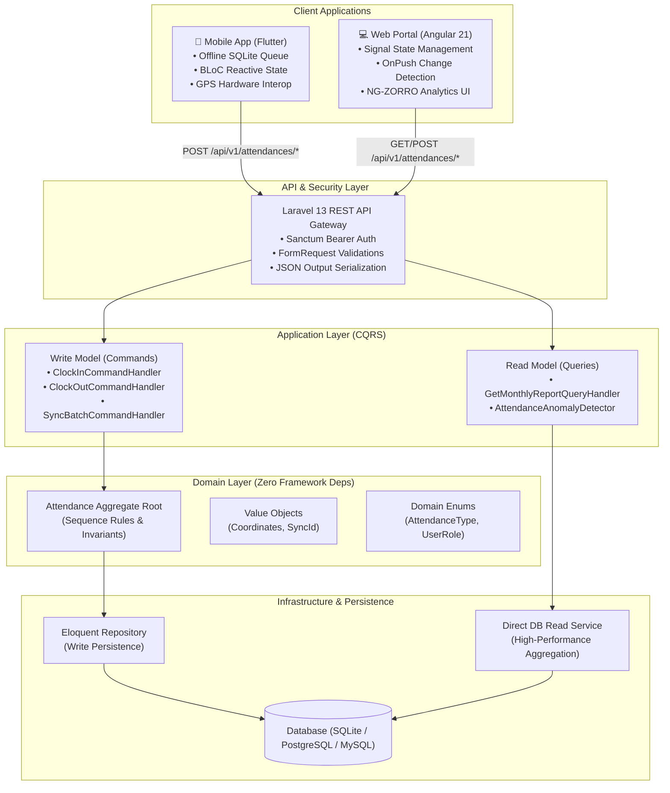

# ArcHub — Enterprise Workforce & Attendance Management Platform

[](https://sonarcloud.io/summary/new_code?id=davide-nava_archub)
[](https://laravel.com)
[](https://php.net)
[](https://angular.dev)
[](https://flutter.dev)
[](LICENSE)

**ArcHub** is an enterprise-grade Workforce & Attendance Management solution engineered for high resilience, offline-first reliability, and real-time operational transparency. It unifies high-performance backend domain services with modern web portal analytics and offline-resilient mobile punch tracking.

---

## 📑 Table of Contents

- [Key Capabilities](#-key-capabilities)
- [System Architecture](#-system-architecture)
- [Technology Stack](#-technology-stack)
- [Monorepo Directory Layout](#-monorepo-directory-layout)
- [Component Breakdown](#-component-breakdown)
  - [1. Backend API & Domain Core (`src/backend/archub`)](#1-backend-api--domain-core)
  - [2. Web Portal & Analytics (`src/frontend/archub`)](#2-web-portal--analytics)
  - [3. Mobile Application (`src/mobile/archub`)](#3-mobile-application)
- [REST API Reference](#-rest-api-reference)
- [Getting Started & Local Setup](#-getting-started--local-setup)
  - [Prerequisites](#prerequisites)
  - [Backend Setup](#backend-setup)
  - [Frontend Setup](#frontend-setup)
  - [Mobile Setup](#mobile-setup)
- [Testing & Quality Assurance](#-testing--quality-assurance)
- [CI/CD & Code Quality](#-cicd--code-quality)
- [License](#-license)

---

## 🚀 Key Capabilities

- **Dual-Channel Attendance Capture:** Seamless time tracking across desktop browsers (Angular 21) and cross-platform mobile devices (Flutter / iOS & Android).
- **Offline-First Resilience:** Local SQLite-backed punch queuing on mobile devices guarantees zero data loss in industrial environments, remote sites, or unstable network conditions.
- **Idempotent Batch Synchronization:** Network requests utilize unique UUID v4 `sync_id` tokens with atomic SQLite transactions, preventing duplicate punches during automatic or manual batch retries.
- **Domain-Driven Design (DDD) & CQRS:** Complete separation of business rules, write commands (`ClockIn`, `ClockOut`, `SyncBatch`), and zero-overhead direct database read models (`SqliteAttendanceReportReadService`).
- **Intelligent Anomaly Detection:** Automated analysis engine detects missing clock-outs, duplicate punches, out-of-sequence breaks, shift duration violations (>12h), and excessive break times (>2h).
- **Geolocation & Accuracy Auditing:** Captures real-time GPS coordinates (latitude, longitude, horizontal accuracy) with every time punch.
- **Workforce Analytics & Pay Estimation:** Computes net worked hours, overtime balance, expected schedules, attendance ratios, and estimated payroll figures in real time.
- **Enterprise Security:** Laravel Sanctum token-based authentication, functional Angular route guards (`authGuard`, `guestGuard`), and automatic 401 token refresh/interception.

---

## 🏗 System Architecture

The ArcHub ecosystem employs a decoupled, multi-tier architecture featuring **Hexagonal / Clean Architecture** on the backend, **Signals-based Clean Architecture** on the frontend, and **Feature-First BLoC Clean Architecture** on mobile.



---

## 💻 Technology Stack

| Layer | Technology | Version | Purpose / Key Libraries |
| :--- | :--- | :--- | :--- |
| **Backend Core** | PHP | `^8.3` | Modern strictly-typed runtime |
| **Backend Framework** | Laravel | `^13.17` | REST API, DI Container, Eloquent ORM, Artisan CLI |
| **Backend Tooling** | Laravel Boost / Pint | `^2.2` / `^1.27` | AI agent integration and code style automation |
| **Backend Testing** | Pest PHP | `^5.1` | Expressive BDD unit and feature testing |
| **Frontend Framework** | Angular | `^21.2.0` | Modern standalone components, Signals reactivity |
| **Frontend UI System** | NG-ZORRO | `^21.3.3` | Enterprise Ant Design component library |
| **Frontend Tooling** | Vite & Vitest | `^4.0.8` | Ultra-fast build pipeline & JSDOM unit test runner |
| **Mobile Framework** | Flutter / Dart | `^3.13` / `^3.x` | Cross-platform native mobile application |
| **Mobile State** | Flutter BLoC | `^9.1.1` | Predictable unidirectional state management |
| **Mobile Local DB** | SQLite (`sqflite`) | `^2.4.1` | Offline punch store & batch transaction queue |
| **Mobile Networking** | Dio | `^5.11.0` | HTTP client with token injection and timeout control |
| **Mobile Hardware** | Geolocator | `^13.0.2` | High-precision GPS coordinates acquisition |
| **Mobile DI** | GetIt | `^9.2.1` | Compile-safe service locator & dependency injection |
| **Quality & CI/CD** | SonarCloud | Latest | Static code analysis, security scanning & code smells |

---

## 📂 Monorepo Directory Layout

```text
archub/
├── .github/
│   └── workflows/
│       └── sonarcloud.yml              # Automated SonarCloud static analysis workflow
├── src/
│   ├── backend/
│   │   └── archub/                     # Laravel 13 Backend Application
│   │       ├── app/
│   │       │   ├── Http/Controllers/   # Thin REST API controllers
│   │       │   ├── Http/Requests/      # FormRequests with command mapping & validation
│   │       │   ├── Http/Resources/     # JsonResource transformation contracts
│   │       │   ├── Models/             # Eloquent models (User, Attendance)
│   │       │   └── Providers/          # Dependency injection bindings
│   │       ├── src/                    # Pure Clean Architecture & DDD layers
│   │       │   ├── Domain/             # Aggregate Roots, Value Objects, Enums, Interfaces
│   │       │   ├── Application/        # CQRS Commands, Handlers, Queries, DTOs, Services
│   │       │   └── Infrastructure/     # Eloquent repositories & direct SQLite read models
│   │       ├── database/               # Migrations, seeders, and factories
│   │       ├── routes/                 # Versioned API routes (api.php) & console schedules
│   │       └── tests/                  # Pest Feature & Unit test suites
│   │
│   ├── frontend/
│   │   └── archub/                     # Angular 21 Standalone Web Portal
│   │       ├── src/
│   │       │   ├── app/
│   │       │   │   ├── core/           # Auth guards, HTTP interceptors, token storage
│   │       │   │   ├── features/
│   │       │   │   │   ├── auth/       # Login flows & credential handling
│   │       │   │   │   └── attendance/ # Monthly timesheets, KPI widgets, anomaly resolver
│   │       │   │   └── layout/         # Shell components (Header, Nav)
│   │       │   └── environments/       # Environment endpoints (dev, prod)
│   │       └── package.json
│   │
│   └── mobile/
│       └── archub/                     # Flutter Mobile Application
│           ├── lib/
│           │   ├── core/               # SQLite database, DI (GetIt), ApiClient, Location
│           │   ├── features/
│           │   │   └── clocking/       # Time clock feature (Domain, Data, Presentation)
│           │   │       ├── domain/     # Entities, Use Cases, Repository contracts
│           │   │       ├── data/       # Local SQLite & remote API data sources
│           │   │       └── presentation/ # BLoC state machine, PunchScreen, widgets
│           │   └── main.dart           # App bootstrapper, theme configuration
│           ├── test/                   # Unit, BLoC, and Widget tests
│           └── pubspec.yaml
│
├── sonar-project.properties            # SonarCloud scanner configuration
├── LICENSE                             # MIT License
└── README.md                           # Main project documentation
```

---

## 🔍 Component Breakdown

### 1. Backend API & Domain Core

Located in `src/backend/archub`, the backend coordinates all business logic and persistence:

- **Strict Invariant Guarding:** The `Attendance` aggregate root enforces valid transitions between states (`CLOCK_IN` ➔ `BREAK_START` ➔ `BREAK_END` ➔ `CLOCK_OUT`). Double clock-ins or clocking out without an active clock-in trigger domain exceptions (`DoubleClockInException`, `InvalidAttendanceSequenceException`).
- **Idempotent Sync Engine:** The `SyncBatchAttendancesCommandHandler` accepts bulk logs from mobile devices, mapping incoming payloads through `sync_id` unique constraints to ensure exactly-once execution.
- **Anomaly Detection Service:** `AttendanceAnomalyDetector` calculates daily work duration, break duration, overtime balance against standard thresholds (8h standard, 12h max daily limit, 2h max break limit), flagging discrepancies for supervisor resolution.
- **Direct DB Read Model:** Queries bypass Eloquent ORM hydration and utilize `SqliteAttendanceReportReadService` for high-throughput reporting.

### 2. Web Portal & Analytics

Located in `src/frontend/archub`, the Angular 21 web application serves workforce administrators and employees:

- **Signal-Driven Reactivity:** Leverages Angular Signals (`signal`, `computed`) for fine-grained state derivation and instant template updates.
- **OnPush Change Detection:** All components declare `ChangeDetectionStrategy.OnPush` to maximize rendering performance and eliminate unnecessary digest cycles.
- **Interactive Timesheet Dashboard:** Displays summary KPI cards (total worked, expected hours, overtime, balance, anomaly tally), dynamic month/year filtering, and individual punch history.
- **Robust Security & Interceptors:** `authInterceptor` automatically attaches Bearer tokens and handles `401 Unauthorized` redirects seamlessly.

### 3. Mobile Application

Located in `src/mobile/archub`, the Flutter mobile client is engineered for edge attendance recording:

- **Offline-First Data Pipeline:**
  1. User initiates a punch (Clock In / Break / Clock Out).
  2. The record is instantly committed to local SQLite with status `PENDING`.
  3. An optimistic network dispatch is sent to `/api/v1/attendances/clock-in`.
  4. If online, the record updates to `SYNCED`. If offline, it remains `PENDING` without throwing an exception or interrupting the user.
- **Live Shift Timer & Status Indicators:** Visual timer updates in real time according to the current shift state (Working, On Break, Shift Ended).
- **GPS Verification:** Integrates with `Geolocator` to acquire latitude, longitude, and accuracy radius, validating location permissions before punch registration.

---

## 📡 REST API Reference

All endpoints are versioned under `/api/v1/` with mandatory JSON request/response headers (`Accept: application/json`, `Content-Type: application/json`).

### Endpoints Overview

| Method | Endpoint | Description | Auth Required |
| :--- | :--- | :--- | :--- |
| `POST` | `/api/v1/attendances/clock-in` | Register a clock-in punch | Yes |
| `POST` | `/api/v1/attendances/clock-out` | Register a clock-out punch | Yes |
| `POST` | `/api/v1/attendances/sync` | Bulk idempotent punch synchronization | Yes |
| `GET` | `/api/v1/attendances/monthly-report` | Fetch aggregated monthly attendance report | Yes |

### 1. Clock In Punch
**`POST /api/v1/attendances/clock-in`**

**Request Body:**
```json
{
  "user_id": "018f3a5e-9a1b-7c3d-8e4f-5a6b7c8d9e0f",
  "recorded_at": "2026-08-27 09:00:00",
  "latitude": 45.4642,
  "longitude": 9.1900,
  "device_id": "mobile-pixel-8-pro",
  "sync_id": "c7a8b9d0-1234-4567-89ab-cdef01234567",
  "is_manual_override": false
}
```

**Response (`201 Created`):**
```json
{
  "data": {
    "id": "9b1deb4d-3b7d-4bad-9bdd-2b0d7b3dcb6d",
    "user_id": "018f3a5e-9a1b-7c3d-8e4f-5a6b7c8d9e0f",
    "type": "CLOCK_IN",
    "recorded_at": "2026-08-27 09:00:00",
    "latitude": 45.4642,
    "longitude": 9.19,
    "device_id": "mobile-pixel-8-pro",
    "sync_id": "c7a8b9d0-1234-4567-89ab-cdef01234567",
    "is_manual_override": false,
    "created_at": "2026-08-27 09:00:00"
  }
}
```

### 2. Batch Synchronization
**`POST /api/v1/attendances/sync`**

**Request Body:**
```json
{
  "items": [
    {
      "user_id": "018f3a5e-9a1b-7c3d-8e4f-5a6b7c8d9e0f",
      "type": "CLOCK_IN",
      "recorded_at": "2026-08-27 08:30:00",
      "sync_id": "f81d4fae-7dec-11d0-a765-00a0c91e6bf6",
      "latitude": 45.4642,
      "longitude": 9.1900
    },
    {
      "user_id": "018f3a5e-9a1b-7c3d-8e4f-5a6b7c8d9e0f",
      "type": "CLOCK_OUT",
      "recorded_at": "2026-08-27 17:30:00",
      "sync_id": "f81d4fae-7dec-11d0-a765-00a0c91e6bf7",
      "latitude": 45.4642,
      "longitude": 9.1900
    }
  ]
}
```

**Response (`200 OK`):**
```json
{
  "data": {
    "total_processed": 2,
    "inserted": 2,
    "updated": 0,
    "synced_ids": [
      "f81d4fae-7dec-11d0-a765-00a0c91e6bf6",
      "f81d4fae-7dec-11d0-a765-00a0c91e6bf7"
    ]
  }
}
```

### 3. Monthly Attendance Report
**`GET /api/v1/attendances/monthly-report?user_id={uuid}&year=2026&month=8`**

**Response (`200 OK`):**
```json
{
  "data": {
    "year": 2026,
    "month": 8,
    "user_id": "018f3a5e-9a1b-7c3d-8e4f-5a6b7c8d9e0f",
    "total_worked_hours": 168.5,
    "total_break_hours": 21.0,
    "total_overtime_hours": 8.5,
    "total_estimated_pay": 3370.0,
    "days": [
      {
        "date": "2026-08-03",
        "first_clock_in": "2026-08-03 08:58:00",
        "last_clock_out": "2026-08-03 17:30:00",
        "worked_hours": 8.0,
        "break_hours": 0.5,
        "overtime_hours": 0.0,
        "has_anomaly": false,
        "anomalies": []
      }
    ]
  }
}
```

---

## ⚡ Getting Started & Local Setup

### Prerequisites

Ensure the following tools are installed on your environment:
- **PHP:** `^8.3` with `sqlite3`, `mbstring`, `pdo`, `curl`, and `openssl` extensions.
- **Composer:** `^2.7`
- **Node.js:** `^20.x` or `^22.x` & **npm:** `^10.x` or `^11.x`
- **Flutter SDK:** `^3.13.1` (or latest stable) with Android/iOS toolchains configured.

---

### Backend Setup

1. Navigate to the backend directory:
   ```bash
   cd src/backend/archub
   ```
2. Install PHP dependencies:
   ```bash
   composer install
   ```
3. Prepare environment configuration:
   ```bash
   cp .env.example .env
   php artisan key:generate
   ```
4. Initialize the SQLite database and run migrations & seeders:
   ```bash
   touch database/database.sqlite
   php artisan migrate --seed
   ```
5. Start the local development server:
   ```bash
   php artisan serve
   ```
   The backend API will be reachable at `http://127.0.0.1:8000`.

---

### Frontend Setup

1. Navigate to the frontend directory:
   ```bash
   cd src/frontend/archub
   ```
2. Install dependencies:
   ```bash
   npm install
   ```
3. Launch the development server:
   ```bash
   npm start
   # or
   npx ng serve
   ```
4. Open your browser and navigate to `http://localhost:4200`.

---

### Mobile Setup

1. Navigate to the mobile directory:
   ```bash
   cd src/mobile/archub
   ```
2. Fetch dependencies:
   ```bash
   flutter pub get
   ```
3. Launch on a connected device, emulator, or simulator:
   ```bash
   flutter run
   ```

---

## 🧪 Testing & Quality Assurance

Every layer of the platform is covered by comprehensive unit, integration, and feature test suites.

### Backend Testing (Pest PHP)
```bash
cd src/backend/archub

# Run all Feature and Unit tests
php artisan test

# Run tests with Pest compact formatting
./vendor/bin/pest

# Run code style checks (Laravel Pint)
./vendor/bin/pint --test
```

### Frontend Testing (Vitest & Angular TestBed)
```bash
cd src/frontend/archub

# Run complete unit test suite once
npx ng test --watch=false

# Run tests in interactive watch mode
npm test

# Build production bundle to verify compilation & budgets
npm run build
```

### Mobile Testing (`flutter_test` & `bloc_test`)
```bash
cd src/mobile/archub

# Run all unit, BLoC, and widget tests
flutter test

# Run tests with code coverage output
flutter test --coverage

# Static code analysis
flutter analyze
```

---

## 🛡 CI/CD & Code Quality

The repository includes pre-configured automation for GitHub Actions and SonarCloud:
- **`.github/workflows/sonarcloud.yml`**: Triggers deep static code analysis and security scans on push/PR to `main`, `master`, and `develop`.
- **`sonar-project.properties`**: Excludes non-source build and vendor assets (`node_modules`, `vendor`, `.dart_tool`, `build`).

---

## 📄 License

ArcHub is open-source software licensed under the [MIT License](LICENSE).
