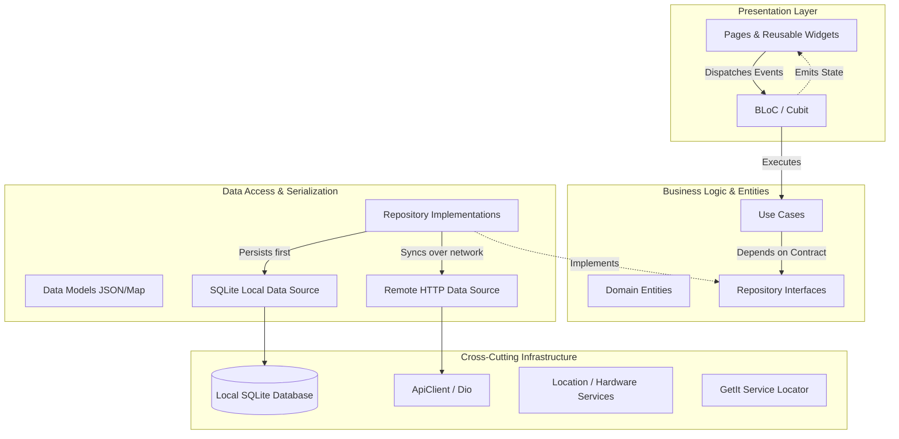

# ARCHITECTURE.md — System Architecture & Design Guide

> **Application:** ArcHub Mobile  
> **Core Architectural Paradigm:** Feature-First Clean Architecture  
> **Resilience Strategy:** Offline-First with SQLite & Background Synchronization  
> **State Management:** Reactive BLoC Pattern (`flutter_bloc`)

---

## 1. Architectural Philosophy & Layering

The codebase is structured following **Clean Architecture principles** with a **Feature-First modular layout**. Every feature represents a self-contained bounded context with three internal layers: **Domain**, **Data**, and **Presentation**.



---

## 2. Directory Structure

```text
lib/
├── core/                               # Cross-cutting foundational layer
│   ├── constants/                      # Global & API endpoint constants
│   │   └── api_constants.dart
│   ├── database/                       # SQLite database initializer and schema
│   │   └── app_database.dart
│   ├── di/                             # Dependency Injection setup (GetIt)
│   │   └── injection.dart
│   ├── error/                          # Failures & Exceptions definitions
│   │   ├── exceptions.dart
│   │   └── failures.dart
│   ├── network/                        # HTTP client wrapper & interceptors
│   │   └── api_client.dart
│   └── services/                       # Hardware / OS service abstractions
│       └── location_service.dart
│
├── features/                           # Self-contained feature modules
│   └── clocking/                       # Time Tracking & Attendance Feature
│       ├── domain/                     # Pure business logic (framework independent)
│       │   ├── entities/               # Business domain models
│       │   │   ├── attendance_entity.dart
│       │   │   ├── attendance_type.dart
│       │   │   └── sync_status.dart
│       │   ├── repositories/           # Abstract repository contracts
│       │   │   └── attendance_repository.dart
│       │   └── usecases/               # Granular application use cases
│       │       ├── clock_in_usecase.dart
│       │       ├── get_attendance_history_usecase.dart
│       │       ├── get_last_punch_usecase.dart
│       │       ├── get_pending_punches_count_usecase.dart
│       │       └── sync_offline_punches_usecase.dart
│       │
│       ├── data/                       # Data access & external implementations
│       │   ├── datasources/
│       │   │   ├── local/              # SQLite data source (CRUD & batching)
│       │   │   │   └── sqlite_attendance_local_data_source.dart
│       │   │   └── remote/             # Laravel API endpoints (/clock-in, /sync)
│       │   │       └── attendance_remote_data_source.dart
│       │   ├── models/                 # SQLite Map & API JSON serialization
│       │   │   └── attendance_model.dart
│       │   └── repositories/           # Concrete repository implementation
│       │       └── attendance_repository_impl.dart
│       │
│       └── presentation/               # UI, Widgets, and State Management
│           ├── bloc/                   # BLoC, Events, and States
│           │   ├── clocking_bloc.dart
│           │   ├── clocking_event.dart
│           │   └── clocking_state.dart
│           └── pages/                  # Screens and modular UI components
│               ├── punch_screen.dart
│               └── widgets/
│                   ├── action_punch_button.dart
│                   ├── gps_badge.dart
│                   ├── live_shift_timer.dart
│                   ├── pending_sync_badge.dart
│                   └── recent_punches_list.dart
│
└── main.dart                           # App entry point, DI bootstrapper, App theme
```

---

## 3. Data Flow & State Lifecycle

Every user interaction follows a strict unidirectional data flow:

```
[User Tap] 
   ⬇
[UI Page / Widget] 
   ⬇ add(ClockingPunchSubmitted)
[ClockingBloc] 
   ⬇ captures LocationData & calls
[ClockInUseCase] 
   ⬇ recordPunch(type, coords, note)
[AttendanceRepositoryImpl]
   ├── 1. Inserts into SQLite as PENDING ────▶ [SqliteAttendanceLocalDataSource]
   ├── 2. Calls Remote API /clock-in ────────▶ [AttendanceRemoteDataSource] (POST)
   │        ├── [Online Success] ─────────────▶ Local record updated to SYNCED
   │        └── [Network / Offline Error] ───▶ Local record remains PENDING (No UI crash)
   ⬇
[Returns Either<Failure, AttendanceEntity>]
   ⬇
[ClockingBloc emits ClockingState (Synced | OfflineCached)]
   ⬇
[UI updates Timer, Pending Badge, and displays SnackBar confirmation]
```

---

## 4. Offline-First SQLite Strategy

The offline-first strategy ensures zero data loss, even in industrial or remote environments with intermittent or non-existent cellular connection:

### Local Schema (`offline_punches`)
```sql
CREATE TABLE offline_punches (
  id TEXT PRIMARY KEY,               -- UUID v4
  user_id TEXT NOT NULL,
  type TEXT NOT NULL,                -- CLOCK_IN, CLOCK_OUT, BREAK_START, BREAK_END
  timestamp TEXT NOT NULL,           -- ISO-8601 UTC
  latitude REAL,
  longitude REAL,
  accuracy REAL,
  sync_status TEXT NOT NULL,         -- 'PENDING' | 'SYNCED'
  note TEXT,
  created_at TEXT NOT NULL,
  synced_at TEXT
);

CREATE INDEX idx_offline_punches_sync_status ON offline_punches (sync_status);
CREATE INDEX idx_offline_punches_timestamp ON offline_punches (timestamp DESC);
```

### Sync Lifecycle:
1. **Local Immediate Commit:** Every punch is written immediately to SQLite with `sync_status = 'PENDING'`.
2. **Optimistic Online Sync:** If connected, an immediate POST request is dispatched to `/clock-in`. On HTTP 200/201, the local row is updated to `SYNCED`.
3. **Graceful Offline Tolerance:** If the network request fails (`SocketException`, timeout, HTTP 5xx), the repository catches the exception and returns the locally persisted record without failing the user experience.
4. **Batch Sync Recovery:** When connectivity resumes or upon manual user trigger (`ClockingSyncRequested`), all `PENDING` rows are retrieved in chronological order, sent in batch to `/sync`, and updated to `SYNCED` atomically via a SQLite batch transaction.

---

## 5. Network Layer & Error Handling

### HTTP Client Configuration
- **Base Client:** `ApiClient` wraps `Dio` with custom headers (`application/json`), global timeout limits (10s), and token authorization management (`setAuthToken`).
- **Exception Hierarchy:**
  - `ServerException`: Non-2xx HTTP status codes or API validation errors.
  - `NetworkException`: Timeouts, connection refused, or unreachable host.
  - `CacheException`: SQLite read/write failures.
  - `LocationException`: GPS disabled or permissions denied.
- **Failure Mapping:**
  Data source exceptions are caught in Repository implementations and mapped into immutable `Failure` instances (`ServerFailure`, `NetworkFailure`, `CacheFailure`, `LocationFailure`) before being returned via `Either<Failure, T>`.

---

## 6. Dependency Injection (GetIt)

All dependencies are wired in `lib/core/di/injection.dart`:
- **Singletons:** `ApiClient`, `LocationService`, `SqliteAttendanceLocalDataSource`, `AttendanceRemoteDataSourceImpl`, `AttendanceRepositoryImpl`, and Use Cases.
- **Factories:** `ClockingBloc` (instantiated per screen lifecycle with its dependencies injected).

```dart
// Dependency retrieval
final bloc = sl<ClockingBloc>();
```
